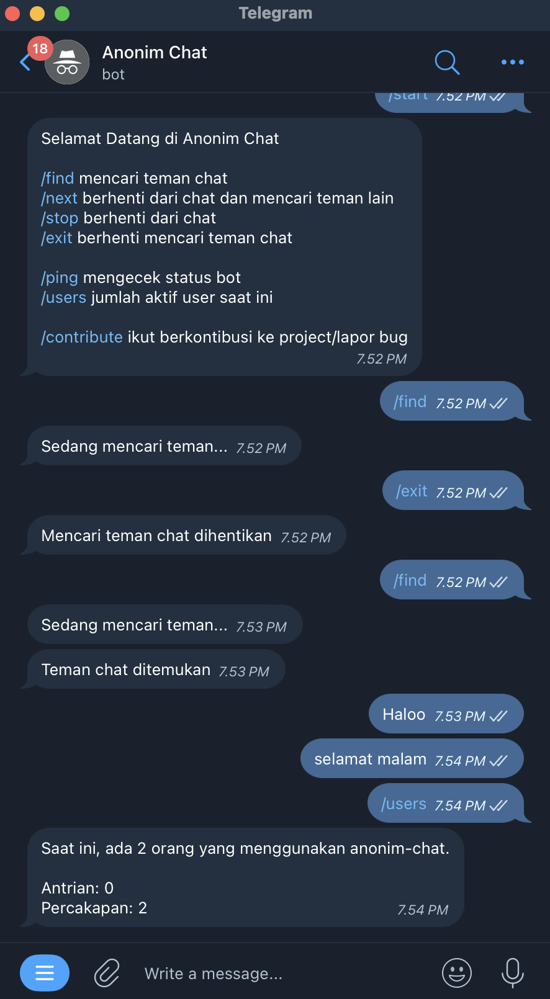

# anonim-chat
[](https://github.com/Shiyinq/anonim-chat)


|  |  |  |
|:---:|:---:|:---:|

Chat anonymously with a stranger.

## Table of Contents
- [Requirements](#requirements)
- [Development](#development)
- [Deployment](#deployment)

## Requirements
- Node.js v20.10.0
- NPM v10.2.3
- Nodemon (latest version)
- MongoDB v5

## Development
Follow these steps to set up the project for development.

### 1. Clone the repository
```bash
git clone https://github.com/Shiyinq/anonim-chat.git
```

### 2. Navigate to the project directory
```bash
cd anonim-chat
```

### 3. Install dependencies
```bash
npm install
```

### 4. Create a `.env` file
```bash
cp .env.example .env
```

### 5. Configure the environment
Open the `.env` file and fill in the `BOT_TOKEN`. You can obtain the token from [@BotFather](https://t.me/botfather).

### 6. Run the bot in development mode
```bash
npm run dev
```

### 7. Test your bot
- Open Telegram and find the bot you created using @BotFather.
- Start a conversation with your bot to verify that it responds correctly.
- For a more thorough test:
  - Use two different Telegram accounts.
  - Simulate a conversation between two users.

## Deployment
To deploy the bot using Docker, follow these steps.

### 1. Clone the repository
```bash
git clone https://github.com/Shiyinq/anonim-chat.git
cd anonim-chat
```

### 2. Create the environment file
```bash
cp .env.example .env
```
Open the `.env` file and update the necessary values.

### 3. Build and run the Docker containers
```bash
docker compose up --build -d
```
Wait a few moments for the setup to complete. The bot will be running at http://localhost:8080.

